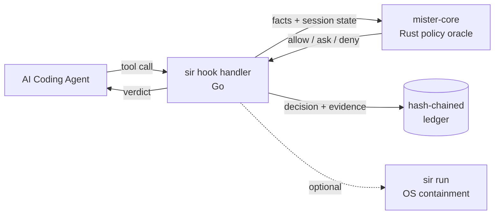

# sir — Sandbox in Reverse

> A local, hook-mediated security runtime for AI coding agents. Quiet on normal coding. Loud on dangerous transitions.

[](https://github.com/somoore/sir/actions/workflows/ci.yml)
[](https://securityscorecards.dev/viewer/?uri=github.com/somoore/sir)
[](LICENSE)
[](cmd/sir/version.go)
[](#honest-limitations)

sir is a security runtime for AI coding agents — **Claude Code**, **Gemini CLI**, and **Codex**. Traditional sandboxes constrain a process from below: syscalls, filesystem jails, namespaces. sir constrains the *agent* from above. It intercepts tool calls at the hook layer before they execute, decides allow / ask / deny against a local policy oracle, and writes every decision to an immutable hash-chained ledger.

---

## The thesis

AI coding agents are not a single sandboxable process. They orchestrate tools, spawn subprocesses, and call MCP servers. The dangerous surface is not syscalls — it is *intents* like "read `.env`, then curl an external host."

sir uses **information flow control (IFC)** to track data sensitivity through operations. Once an agent reads a secret file, that taint propagates to anything it writes, commits, or tries to push.

> **Design rule:** quiet on normal coding, loud on dangerous transitions. Reads, edits, tests, commits, and loopback traffic stay silent. Only risky transitions — external network, secret egress, posture tampering, MCP injection — trigger prompts or denials.

## The problem sir solves

- AI coding agents routinely touch secrets (`.env`, cloud credentials, SSH keys) in the same session where they run shell and push code.
- MCP servers are a prompt-injection surface. Nothing currently checks what agents paste into them or what they exfiltrate through them.
- Provider logs stop at the governance layer. There is no local, tamper-evident audit trail of what the agent actually did on your machine.

sir addresses all three: intent mediation at the hook boundary, MCP argument and response scanning, and a hash-chained append-only ledger you can verify yourself.

## At a glance



- **Go CLI (`sir`)** — collects facts, manages session state, writes the ledger, talks to host-agent hooks.
- **Rust policy oracle (`mister-core`)** — zero-dependency, zero-unsafe. Decides allow / ask / deny from normalized inputs.
- **Ledger** — append-only, length-prefixed hash chain (v2.1). Verifiable with `sir log verify`.
- **No daemon, no phone-home, no external dependency on the normal path.**

## Supported agents

| Agent | Status | Hook events | Notes |
|---|---|---|---|
| **Claude Code** | Reference support | 10 | Full lifecycle with native interactive approval and complete tool-path coverage. |
| **Gemini CLI** | Near-parity | 6 | Gemini CLI 0.36.0+. Missing `SubagentStart`, `ConfigChange`, `InstructionsLoaded`, `Elicitation`. See [gemini-support.md](docs/user/gemini-support.md). |
| **Codex** | Limited | 5 | `codex-cli` 0.118.0+ with `codex features enable codex_hooks`. Bash-only upstream surface; native writes and MCP tools gated via sentinel hashing + final `Stop` sweep. See [codex-support.md](docs/user/codex-support.md). |

## Honest limitations

sir is **v1 and experimental**. The following tradeoffs are shipped deliberately and documented.

- **Hook-layer, not OS-level.** If a tool executor ignores the hook response, sir cannot stop the operation. `sir run <agent>` adds an optional below-hook containment layer (macOS `sandbox-exec`, Linux `unshare --net`), but it is a measured preview, not the primary shipped boundary.
- **MCP injection detection is heuristic.** Roughly 50 regex patterns across four categories. An arms race by nature. The mitigation is that tainted servers require re-approval.
- **Turn boundaries use a 30-second gap heuristic** and are gameable in theory.
- **Shell classification is lexical, not a full POSIX parser.** It covers the common bypass patterns (wrappers, combined flags, compound commands) but cannot cover every trick.
- **Default lease is developer-friendly.** Push to origin, commit, loopback, and sub-agent delegation are allowed out of the box. Tighten with `sir trust`, `sir allow-host`, and managed policy if you want more.
- **If `mister-core` is not on `PATH`**, Go falls back to a deliberately restrictive subset of the policy. Parity tests enforce that the fallback is never more permissive than Rust.

## Quickstart

The fastest path is `install.sh`. It drops the `sir` binary into `~/.local/bin`, preserves any existing `~/.sir/` state, and is the only supported update path — there is no self-updater.

```bash
curl -sSL https://raw.githubusercontent.com/somoore/sir/main/install.sh | bash
export PATH="$HOME/.local/bin:$PATH"
cd /path/to/project
sir install                  # auto-detect supported agents already on this machine
# or: sir install --agent codex
```

> **Tip:** pipe-to-`bash` auditors can inspect the script first with `curl -sSL ... | less`. `install.sh` verifies SHA-256 checksums and refuses downgrades unless `SIR_ALLOW_DOWNGRADE=1` is set.

### Build from source

Requires [Rust 1.94.0+](https://rustup.rs/) and [Go 1.22+](https://go.dev/dl/) with toolchain auto-fetch to `go1.25.9`.

```bash
make build
make install
cd /path/to/project
sir install --agent gemini
```

### Managed rollout

```bash
export SIR_MANAGED_POLICY_PATH=/etc/sir/managed-policy.json
sir install --agent claude
```

## First run

After `sir install`, launch your agent as usual. You should not notice sir during normal development — that is the point.

Baseline health checks:

```bash
sir status       # hooks installed, session posture, last contained-run info
sir doctor       # hook subtree intact, ledger chain verifies, sentinels unchanged
sir log verify   # walk the hash chain and report first corruption, if any
```

You want to see installed hooks, intact posture, and an intact ledger chain.

### Prove the boundary in one turn

1. Ask the agent to read `.env`.
2. Approve the prompt. sir labels the read as secret and marks the session tainted.
3. In the same turn, ask it to `curl https://httpbin.org/get`.
4. Run `sir explain --last`.

**Expected result:** sir asks before the read, blocks the external request, and records the full causal chain in the ledger. That is IFC taint propagation in action.

## Day-to-day use

| Command | When to use it |
|---|---|
| `sir log`, `sir explain --last`, `sir why` | Investigate why something was blocked or asked. |
| `sir doctor` | Quick health check on hooks, ledger, and sentinels. |
| `sir mcp`, `sir mcp wrap` | Inspect or harden command-based MCP servers. |
| `sir unlock` | Lift a turn-scoped secret taint after a legitimate read. |
| `sir allow-host`, `sir allow-remote`, `sir trust` | Widen the lease — use deliberately. |

## Who this is for

- **Developers** — you want a quiet local guard that catches obvious failure modes (secret egress, posture tampering, MCP injection) without slowing down normal coding, and that gives you an audit trail if something looks wrong later.
- **Researchers** — the threat model is documented in [docs/research/sir-threat-model.md](docs/research/sir-threat-model.md). The policy oracle is a small, zero-dependency Rust crate with hand-maintained parity tests against the Go fallback. The ledger is hash-chained and length-prefix-encoded (v2.1), so collision attacks on the delimiter are in scope.
- **Contributors** — see [CONTRIBUTING.md](CONTRIBUTING.md) and [ARCHITECTURE.md](ARCHITECTURE.md). Go stays standard-library only. `mister-core` stays zero-dependency and zero-unsafe. The fastest orientation is [docs/contributor/first-30-minutes.md](docs/contributor/first-30-minutes.md).

## Documentation

- **Runtime behavior** — [docs/user/runtime-security-overview.md](docs/user/runtime-security-overview.md)
- **Agent integration** — [Claude](docs/user/claude-code-hooks-integration.md) · [Gemini](docs/user/gemini-support.md) · [Codex](docs/user/codex-support.md)
- **Contributor path** — [CONTRIBUTING.md](CONTRIBUTING.md) · [ARCHITECTURE.md](ARCHITECTURE.md) · [docs/README.md](docs/README.md)
- **Verification and evidence** — [security-verification-guide.md](docs/research/security-verification-guide.md) · [validation-summary.md](docs/research/validation-summary.md) · [sir-threat-model.md](docs/research/sir-threat-model.md)
- **FAQ** — [docs/user/faq.md](docs/user/faq.md)

## Security

Please **do not** open a public issue for suspected vulnerabilities. See [SECURITY.md](SECURITY.md) for the private reporting path and scope. In-scope examples include Go widening a Rust deny, ledger chain tampering, and hook-bypass sequences; out-of-scope items track the [Honest limitations](#honest-limitations) above.

## Contributing

Contributions are welcome. Start with [CONTRIBUTING.md](CONTRIBUTING.md) for change lanes, safety rails, and the review checklist. New verbs require a row in `TestLocalEvaluate_VerbParity` and `TestEnforcementGradientDocParity`. Go stays stdlib-only. `mister-core` stays zero-dependency and zero-unsafe.

## License

Licensed under the [Apache License, Version 2.0](LICENSE).
