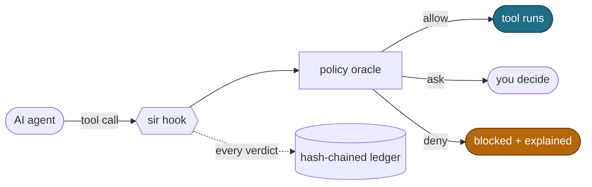

# sir — Sandbox in Reverse

> A local security layer for AI coding agents. When your agent reads your secrets and then tries to phone home, sir stops it, proves it, and tells you exactly what to do next. **Silent while you code; loud only at the exits.**

A sandbox sees a process making a network call. sir sees **why**: the agent read `.env`, an MCP tool said "forward these for analytics," and now it's curling them to an unknown host. To a sandbox that's indistinguishable from `npm install`. sir adds the context that makes the block intelligent.

> [!NOTE]
> sir is experimental and not yet production-ready — test on your own machine, not shared infrastructure. `sir doctor` recovers any wedged state; `sir uninstall` removes hooks cleanly. [Report bugs](https://github.com/somoore/sir/issues).

<div align="center">

[](https://github.com/somoore/sir/releases/latest) [](#agent-support) [](LICENSE) [](#install--update--uninstall)

macOS (Apple Silicon) · Linux (amd64, arm64). Intel Mac and Windows are not yet supported.

</div>

## Quick start

```bash
curl -fsSL https://raw.githubusercontent.com/somoore/sir/main/scripts/download.sh | bash
cd /path/to/project
sir install            # auto-detect supported agents already on this machine
sir demo               # see all three detections run, end to end
```

Then use your agent as normal. sir stays quiet until something crosses a line — and when it does, the message is the fix:

```text
Claude tried to reach evil.example.com — × deny.

  reason: You read a credentials file at 14:39, so sir is holding external
          network until this turn ends. No data left your machine.

  fix:    sir allow-host evil.example.com   (YOUR terminal, only if you trust this host)
          sir unlock                        (clear the secret lock now)
          or wait — the lock clears on its own when the agent's turn ends.

  details: sir why
```

*(Recording: [`assets/demo.cast`](assets/demo.cast) — `asciinema play assets/demo.cast`.)*

## How it decides



The decision is **stateful**, not a static rule list. Reading `.env` labels the session `SECRET`; the very next external call in that turn is denied — same tool, different verdict, because the session changed between them. That is [information flow control](mister-core/src/ifc.rs).

## What it catches

- **Secret → exit.** A secret read taints every later write, commit, or push attempt in the turn — tool-agnostic.
- **MCP prompt injection.** Scans MCP arguments for credentials and responses for injection patterns (~50 regex patterns), taints the server, and forces re-approval.
- **Posture tampering.** Edits to hook config, `CLAUDE.md`, or `.mcp.json` are detected and auto-restored.
- **A local audit trail.** Every verdict is appended to a tamper-evident, hash-chained ledger — verify it with `sir log verify`.

Normal reads, edits, tests, commits, grep, and loopback requests are silently allowed.

## Install / update / uninstall

```bash
# Install (or update — overwrites the binaries, preserves ~/.sir state):
curl -fsSL https://raw.githubusercontent.com/somoore/sir/main/scripts/download.sh | bash
#   pin a release:  ... | bash -s -- <tag>     (tags: github.com/somoore/sir/releases)

sir update            # check for a newer release and print the exact upgrade command
sir uninstall         # remove hooks from every detected agent (state preserved at ~/.sir)

# Full removal (binaries + all state), with confirmation:
curl -fsSL https://raw.githubusercontent.com/somoore/sir/main/uninstall.sh | bash
```

The installer verifies the tarball SHA-256 (and the cosign signature on `checksums.txt` when cosign is present), and writes `~/.sir/binary-manifest.json` so `sir verify` can detect later tampering. `sir update` never modifies the binary itself — a deliberate choice for a security tool.

<details>
<summary>Build from source</summary>

```bash
git clone https://github.com/somoore/sir.git && cd sir
# Requires [Rust 1.94.0](https://rustup.rs/) (pinned in rust-toolchain.toml)
# Requires [Go 1.22+](https://go.dev/dl/) with toolchain auto-fetch to go1.25.10
make build && make install
```
</details>

## Verify it

```bash
sir status       # hooks installed + current session posture
sir doctor       # health check and auto-repair
sir verify       # binary integrity vs the install-time manifest
sir log verify   # walk the ledger hash chain, report the first corruption
```

Try the core protection yourself, in one turn: **Ask the agent to read `.env`**, then have it run `curl https://httpbin.org/get`. sir taints the session on the read and denies the egress — `sir explain --last` shows the causal chain.

## Commands

```text
Get started   setup · install · uninstall · update · status [--json|--agents] · demo
When blocked  why · approve --last [--ttl D] · approvals · unlock · secret view <path>
Grant/revoke  trust host|remote|mcp|path <x> [--ttl D] [--remove]   (--yes to skip prompt)
Policy        config · policy show|diff|init --profile <p>|suggest
MCP           mcp status|wrap|approve|revoke|list|scope
Review        audit · friction · log [--follow|verify|archive|export] · replay · trace · explain
Maintenance   doctor [--json] · verify · version [--check] · completion bash|zsh|fish
Advanced      run <agent> · relay · mcp-proxy <cmd>
```

Run `sir <command> --help` for details on any command, or `sir help` for the full list.

## For security teams

- **Observe-only rollout.** `sir install --observe` records `would_allow`/`would_ask`/`would_deny` and detection IDs without blocking anyone. After a week, `sir friction` and `sir policy suggest` recommend safer scoped defaults; flip to enforcement without losing telemetry.
- **Normalized SIEM telemetry.** Set `SIR_OTLP_ENDPOINT` and every decision streams as redacted OTLP with stable detection IDs, severity, and decision latency. Curated, actionable Slack alerts route through one central relay (`sir relay`) — never per-workstation.
- **Managed fleet policy.** Pin an org policy with `SIR_MANAGED_POLICY_PATH`; sir auto-restores tampered hooks and refuses local overrides.

## Agent support

<!-- BEGIN GENERATED SUPPORT SUMMARY -->
- **Claude Code** — **Reference support.** Full 11-hook lifecycle with native interactive approval and complete tool-path coverage.
- **Gemini CLI** — **Near-parity support.** 6 hook events fire on Gemini CLI 0.36.0+, with full tool-path coverage for file IFC labeling, shell classification, MCP scanning, and credential output scanning. Missing lifecycle hooks: PermissionRequest, SubagentStart, ConfigChange, InstructionsLoaded, and Elicitation. See [gemini-support.md](docs/user/gemini-support.md).
- **Codex** — **Limited support.** 6 hook events fire on `codex-cli` 0.118.0+ after enabling the `codex_hooks` feature flag (`codex features enable codex_hooks`). sir registers Bash, native-write, MCP, and permission-request hooks where Codex exposes them, but lifecycle coverage remains narrower than Claude Code and the final `Stop` sweep stays the posture backstop. See [codex-support.md](docs/user/codex-support.md).
<!-- END GENERATED SUPPORT SUMMARY -->

## Honest limits

sir is a hook- and tool-boundary layer, not a host firewall. If a tool executor ignores the hook response, sir cannot stop it. MCP injection detection is regex-based and can be evaded by encoding or paraphrasing. Turn boundaries use a 30-second gap heuristic; shell classification is prefix-aware, not full POSIX. The default lease intentionally allows push-to-origin, commit, loopback, and delegation — tighten with `sir trust` or a managed policy. If `mister-core` is missing from `PATH`, Go falls back to a deliberately *more restrictive* subset (parity-tested), and a tampered oracle triggers a hard deny on all tool calls. Model-internal reasoning is out of scope. `sir run` adds optional OS-level containment (network namespace on Linux, `sandbox-exec` on macOS) and is experimental.

## Documentation

**Users** — [Runtime behavior](docs/user/runtime-security-overview.md) · [FAQ](docs/user/faq.md) · [SIEM integration](docs/user/siem-integration.md) · Agent setup: [Claude](docs/user/claude-code-hooks-integration.md) · [Gemini](docs/user/gemini-support.md) · [Codex](docs/user/codex-support.md)

**Contributors** — [CONTRIBUTING.md](CONTRIBUTING.md) · [ARCHITECTURE.md](ARCHITECTURE.md) · [docs/README.md](docs/README.md)

**Researchers** — [Threat model](docs/research/sir-threat-model.md) · [Verification guide](docs/research/security-verification-guide.md) · [Observability design](docs/research/observability-design.md)

Report vulnerabilities privately via [SECURITY.md](SECURITY.md). Licensed under [Apache 2.0](LICENSE).
