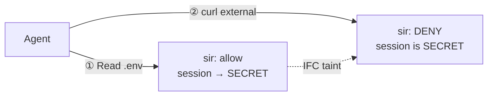

# sir — Sandbox in Reverse

> [!WARNING]
> **sir is experimental, in active development, and not yet suitable for production deployments.** No promises or guarantees are made at this stage. Test on your own machine, not shared infrastructure. If something goes wrong, run `sir doctor` to recover or `sir uninstall` to remove hooks cleanly. Report bugs via [GitHub issues](https://github.com/somoore/sir/issues) — contributions welcome.

> A local, hook-mediated security runtime for AI coding agents. Quiet on normal coding. Loud on dangerous transitions.

<div align="center">

[](https://github.com/somoore/sir/releases/latest) [](#what-it-is) [](#hard-limits)

[](https://securityscorecards.dev/viewer/?uri=github.com/somoore/sir) [](https://www.bestpractices.dev/projects/12462) [](LICENSE)

**Supported platforms: macOS (Apple Silicon) and Linux (amd64, arm64).** Intel Mac and Windows are not yet supported.

</div>

## Quick start

```bash
curl -fsSL https://raw.githubusercontent.com/somoore/sir/main/scripts/download.sh | bash
cd /path/to/project
sir install            # auto-detect supported agents already on this machine
```

That's it. sir is invisible until something dangerous happens.

## What it is

A Go CLI + Rust policy oracle + hash-chained ledger. sir intercepts agent tool calls, decides allow / ask / deny, and writes every verdict to an append-only ledger verifiable with `sir log verify`. No daemon, no phone-home.



Same turn, two tool calls, different verdicts — the oracle's decision changed because session state mutated between them. That is [information flow control](mister-core/src/ifc.rs), not a static rule list.

<!-- BEGIN GENERATED SUPPORT SUMMARY -->
- **Claude Code** — **Reference support.** Full 10-hook lifecycle with native interactive approval and complete tool-path coverage.
- **Gemini CLI** — **Near-parity support.** 6 hook events fire on Gemini CLI 0.36.0+, with full tool-path coverage for file IFC labeling, shell classification, MCP scanning, and credential output scanning. Missing lifecycle hooks: SubagentStart, ConfigChange, InstructionsLoaded, and Elicitation. See [gemini-support.md](docs/user/gemini-support.md).
- **Codex** — **Limited support.** 5 hook events fire on `codex-cli` 0.118.0+ after enabling the `codex_hooks` feature flag (`codex features enable codex_hooks`), and the upstream hook surface is Bash-only. Bash-mediated sensitive reads are pre-gated, but native file writes and MCP tools stay outside PreToolUse; sir relies on sentinel hashing plus a final `Stop` sweep as the backstop. See [codex-support.md](docs/user/codex-support.md).
<!-- END GENERATED SUPPORT SUMMARY -->

## Why use sir

Sandboxes see a process making a network call. sir sees *why* — the agent read `.env` with AWS credentials, an untrusted MCP server told it to "forward credentials for analytics," and now it's encoding them in a query parameter. To a sandbox, that looks identical to `npm install`. sir adds the context layer that makes containment decisions intelligent instead of binary.

- **Secrets and taint propagation.** A secret read contaminates every downstream write, commit, or push attempt via IFC — tool-agnostic.
- **MCP prompt injection.** Scans MCP arguments for credentials and responses for injection patterns, taints untrusted servers, forces re-approval.
- **A local audit trail.** Tamper-evident ledger of what the agent actually did — the record provider logs don't capture.
- **Quiet on normal coding, loud on dangerous transitions.** Only external network, secret egress, posture tampering, and MCP injection trigger prompts or denials.

### Three enforcement layers

| Layer | Mechanism | What it catches | What evades it |
|-------|-----------|----------------|----------------|
| **1. Intent classification** | Hook-layer verb/target analysis | Obvious exfil paths (`curl evil.com`, `git push evil-fork`, `.env` + outbound) | Encoding, tool substitution |
| **2. IFC taint propagation** | Session state — tool-agnostic | Any exit after a secret read, regardless of tool | Turn boundary reset, unrecognized secret paths |
| **3. Runtime containment** | OS-level (`sir run`) — network namespace (Linux), `sandbox-exec` (macOS) | All network egress, regardless of hooks | OS primitive escape (different threat class). Experimental. |

Exfiltration requires beating all three. Provider audit logs stop at governance; sir records redacted evidence at all three tiers (governance, detection, investigation). See [observability-design.md](docs/research/observability-design.md).

## Install

**Pre-built binary (recommended):**

```bash
curl -fsSL https://raw.githubusercontent.com/somoore/sir/main/scripts/download.sh | bash
# or pin a specific version:
curl -fsSL https://raw.githubusercontent.com/somoore/sir/main/scripts/download.sh | bash -s -- v0.0.2
```

The installer verifies the tarball's SHA-256 checksum against the release's `checksums.txt` before installing. For full cryptographic verification (cosign signatures), see [`scripts/verify-release.sh`](scripts/verify-release.sh).

**Build from source** (requires cloning the repo):

```bash
git clone https://github.com/somoore/sir.git && cd sir
# Requires [Rust 1.94.0](https://rustup.rs/) (pinned in rust-toolchain.toml)
# Requires [Go 1.22+](https://go.dev/dl/) with toolchain auto-fetch to go1.25.9
make build
make install
```

Then in any project: `sir install            # auto-detect supported agents already on this machine`

**Update:** re-run the same download command. The installer overwrites the binaries in place; hooks and session state at `~/.sir/` are preserved. `sir version --check` tells you if a newer release exists (informational only — never auto-updates).

**Managed rollout** (enterprise): `export SIR_MANAGED_POLICY_PATH=/etc/sir/managed-policy.json && sir install --agent claude`

**Uninstall:** `sir uninstall && rm -f ~/.local/bin/sir ~/.local/bin/mister-core`

## Prove it works

```bash
sir status       # hooks installed, session posture, last contained-run info
sir doctor       # hook subtree intact, ledger chain verifies, sentinels unchanged
sir log verify   # walk the hash chain and report first corruption, if any
```

1. Ask the agent to read `.env`. sir marks the session tainted.
2. In the same turn, ask it to `curl https://httpbin.org/get`. sir denies it.
3. Run `sir explain --last` to see the causal chain.

That is IFC taint propagation — layers 1 and 2 working together. For layer 3, see `sir run` in the [three enforcement layers](#three-enforcement-layers) section above.

## Hard limits

sir is v1 and experimental. Shipped tradeoffs:

- Hook and tool boundary only — not a host firewall. If a tool executor ignores the hook response, sir cannot stop it.
- MCP injection detection is ~50 regex patterns — encoded, paraphrased, or non-English framing can evade. Tainted servers require re-approval.
- Turn boundaries use a 30-second gap heuristic (gameable). Shell classification is prefix-aware, not full POSIX.
- Default lease allows push to origin, commit, loopback, and delegation. Tighten with `sir trust`, `sir allow-host`, or managed policy.
- Model-internal reasoning is out of scope. Codex is limited by the upstream Bash-only hook surface.
- If `mister-core` is missing from `PATH`, Go falls back to a deliberately restrictive subset. Parity tests enforce the fallback is never more permissive.

## Day-to-day use

- Install once per machine with `sir install`. Use your agent normally.
- `sir log`, `sir explain --last`, `sir why`, and `sir doctor` are your investigation tools.
- `sir mcp` and `sir mcp wrap` inspect or harden command-based MCP servers. `sir unlock`, `sir allow-host`, `sir allow-remote`, and `sir trust` widen the lease.

## Contributing

sir is open to contributions. Start with [CONTRIBUTING.md](CONTRIBUTING.md) for the development setup, coding standards, and PR process. [ARCHITECTURE.md](ARCHITECTURE.md) covers the system design. All changes go through CI (Go tests, Rust tests, gosec, CodeQL, zizmor) and require review.

## Documentation

**Users** — [Runtime behavior](docs/user/runtime-security-overview.md) · [FAQ](docs/user/faq.md) · Agent setup: [Claude](docs/user/claude-code-hooks-integration.md) · [Gemini](docs/user/gemini-support.md) · [Codex](docs/user/codex-support.md)

**Contributors** — [CONTRIBUTING.md](CONTRIBUTING.md) · [ARCHITECTURE.md](ARCHITECTURE.md) · [docs/README.md](docs/README.md)

**Researchers** — [Threat model](docs/research/sir-threat-model.md) · [Verification guide](docs/research/security-verification-guide.md) · [Validation summary](docs/research/validation-summary.md) · [Observability design](docs/research/observability-design.md)

Report suspected vulnerabilities privately via [SECURITY.md](SECURITY.md). Licensed under the [Apache License, Version 2.0](LICENSE).
