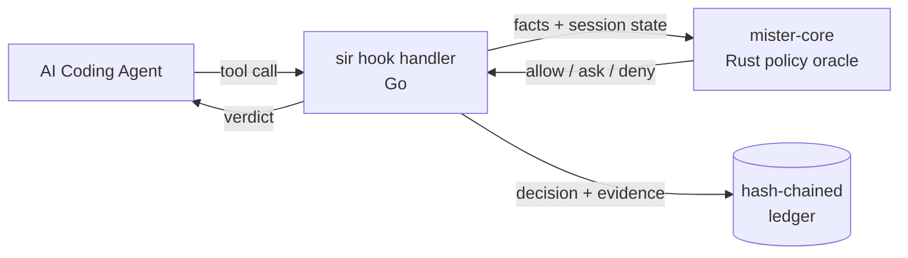

# sir — Sandbox in Reverse

> A local, hook-mediated security runtime for AI coding agents. Quiet on normal coding. Loud on dangerous transitions.

[](https://github.com/somoore/sir/actions/workflows/ci.yml)
[](https://securityscorecards.dev/viewer/?uri=github.com/somoore/sir)
[](LICENSE)
[](#hard-limits)

sir is a security runtime for **Claude Code**, **Gemini CLI**, and **Codex**. Traditional sandboxes constrain a process from below: syscalls, filesystem jails, namespaces. sir constrains the *agent* from above. It intercepts tool calls at the hook layer, decides allow / ask / deny against a local policy oracle, and writes every decision to a hash-chained ledger.

## What it is

- Local enforcement, not a hosted security service. No daemon. No phone-home. No external dependency on the normal path.
- Go CLI (`sir`) plus a zero-dependency Rust policy oracle (`mister-core`).
- Hook-mediated allow / ask / deny decisions, tamper detection with auto-restore, and a verifiable append-only ledger.



## Why use sir

- Agents routinely touch secrets (`.env`, cloud credentials, SSH keys) in the same session where they run shell and push code. sir uses information flow control (IFC) to track that taint through everything the agent writes, commits, or tries to push.
- MCP servers are a prompt-injection surface. sir scans both MCP arguments and responses, taints untrusted servers, and requires re-approval after a hit.
- Provider logs stop at the governance layer. sir writes a local, tamper-evident audit trail of what the agent actually did on your machine.
- Design rule: quiet on normal coding, loud on dangerous transitions. Reads, edits, tests, commits, and loopback traffic stay silent. Only external network, secret egress, posture tampering, and MCP injection trigger prompts or denials.

## Install in 3 minutes

Fastest path — `install.sh` drops `sir` into `~/.local/bin`, preserves any existing `~/.sir/` state, and is the only supported update path. There is no self-updater.

```bash
curl -sSL https://raw.githubusercontent.com/somoore/sir/main/install.sh | bash
export PATH="$HOME/.local/bin:$PATH"
cd /path/to/project
sir install            # auto-detect supported agents already on this machine
# or: sir install --agent codex
```

Build from source if you prefer:

```bash
# Requires [Rust 1.94.0+](https://rustup.rs/)
# Requires [Go 1.22+](https://go.dev/dl/) with toolchain auto-fetch to go1.25.9
make build
make install
cd /path/to/project
sir install            # auto-detect supported agents already on this machine
# or: sir install --agent gemini
```

Managed rollout:

```bash
export SIR_MANAGED_POLICY_PATH=/etc/sir/managed-policy.json
sir install --agent claude
```

### Supported agents

<!-- BEGIN GENERATED SUPPORT SUMMARY -->
- **Claude Code** — **Reference support.** Full 10-hook lifecycle with native interactive approval and complete tool-path coverage.
- **Gemini CLI** — **Near-parity support.** 6 hook events fire on Gemini CLI 0.36.0+, with full tool-path coverage for file IFC labeling, shell classification, MCP scanning, and credential output scanning. Missing lifecycle hooks: SubagentStart, ConfigChange, InstructionsLoaded, and Elicitation. See [gemini-support.md](docs/user/gemini-support.md).
- **Codex** — **Limited support.** 5 hook events fire on `codex-cli` 0.118.0+ after enabling the `codex_hooks` feature flag (`codex features enable codex_hooks`), and the upstream hook surface is Bash-only. Bash-mediated sensitive reads are pre-gated, but native file writes and MCP tools stay outside PreToolUse; sir relies on sentinel hashing plus a final `Stop` sweep as the backstop. See [codex-support.md](docs/user/codex-support.md).
<!-- END GENERATED SUPPORT SUMMARY -->

## Prove it works

Run the baseline checks:

```bash
sir status       # hooks installed, session posture, last contained-run info
sir doctor       # hook subtree intact, ledger chain verifies, sentinels unchanged
sir log verify   # walk the hash chain and report first corruption, if any
```

You want to see installed hooks, intact posture, and an intact ledger chain.

Then trigger one real protection path:

1. Ask the agent to read `.env`.
2. Approve it. sir labels the read as secret and marks the session tainted.
3. In the same turn, ask it to `curl https://httpbin.org/get`.
4. Run `sir explain --last`.

Expected result: sir asks before the read, blocks the external request, and records the full causal chain in the ledger. That is IFC taint propagation in action.

## Hard limits

sir is v1 and experimental. The following tradeoffs are shipped deliberately.

- sir is strongest at the hook and tool boundary. It is not yet a complete host firewall.
- `sir run <agent>` is a measured preview of below-hook containment (macOS `sandbox-exec`, Linux `unshare --net`). `sir status` reports launch mode, policy size, and blocked/allowed egress counts from the most recent contained run.
- MCP injection detection is a set of roughly 50 regex patterns — an arms race by nature. Tainted servers require re-approval as the mitigation.
- Turn boundaries use a 30-second gap heuristic and are gameable in theory.
- Shell classification is wrapper-aware and prefix-aware, not full POSIX semantics.
- Default lease allows push to origin, commit, loopback, and sub-agent delegation. Tighten with `sir trust`, `sir allow-host`, or managed policy.
- Model-internal reasoning and paraphrase are out of scope.
- Codex remains limited by the upstream Bash-only hook surface.

## Day-to-day use

- Install once per machine with `sir install`. Use your agent normally.
- `sir log`, `sir explain --last`, `sir why`, and `sir doctor` are your investigation tools.
- `sir mcp` and `sir mcp wrap` inspect or harden command-based MCP servers.
- `sir unlock`, `sir allow-host`, `sir allow-remote`, and `sir trust` widen the lease — use them only when you intend to.

## Documentation

- Runtime behavior — [docs/user/runtime-security-overview.md](docs/user/runtime-security-overview.md)
- Agent integration — [Claude](docs/user/claude-code-hooks-integration.md) · [Gemini](docs/user/gemini-support.md) · [Codex](docs/user/codex-support.md)
- Contributor path — [CONTRIBUTING.md](CONTRIBUTING.md) · [ARCHITECTURE.md](ARCHITECTURE.md) · [docs/README.md](docs/README.md)
- Verification and evidence — [security-verification-guide.md](docs/research/security-verification-guide.md) · [validation-summary.md](docs/research/validation-summary.md) · [sir-threat-model.md](docs/research/sir-threat-model.md)
- FAQ — [docs/user/faq.md](docs/user/faq.md)

Report suspected vulnerabilities privately via [SECURITY.md](SECURITY.md). Licensed under the [Apache License, Version 2.0](LICENSE).
